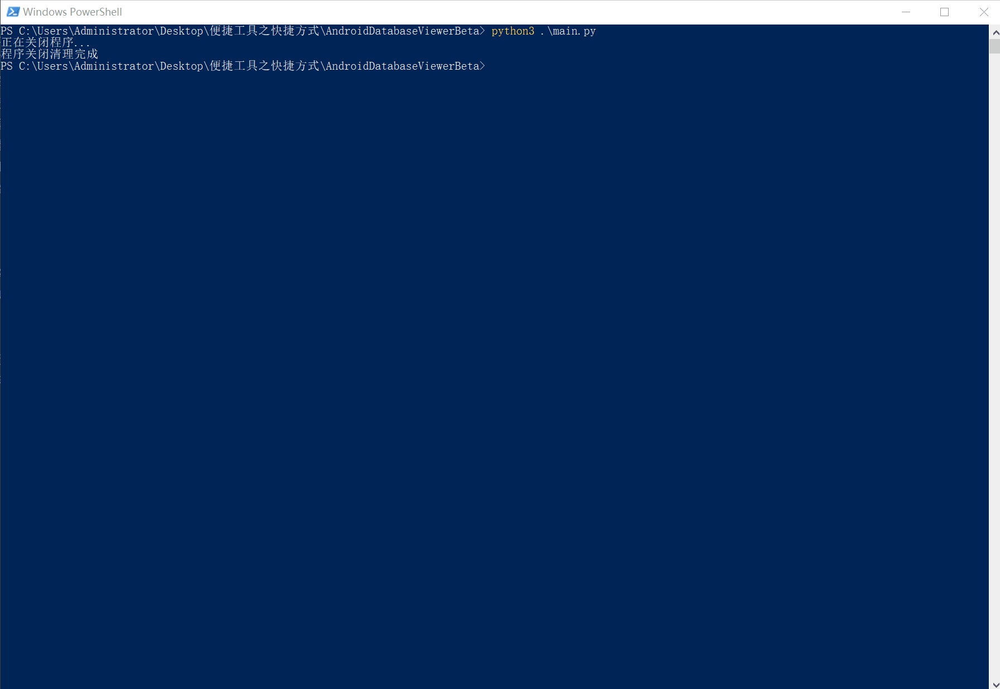
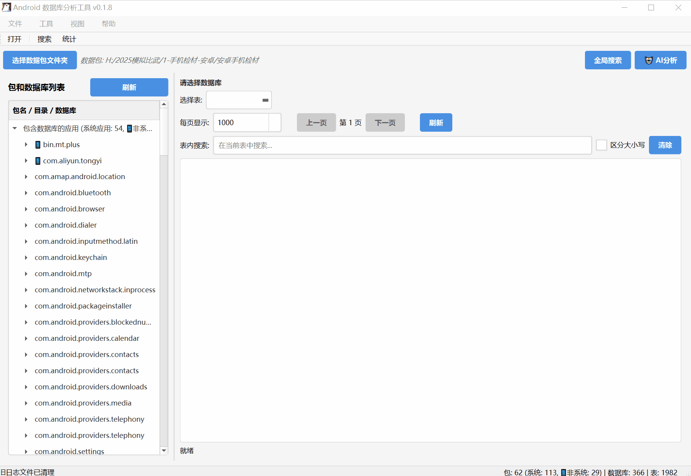
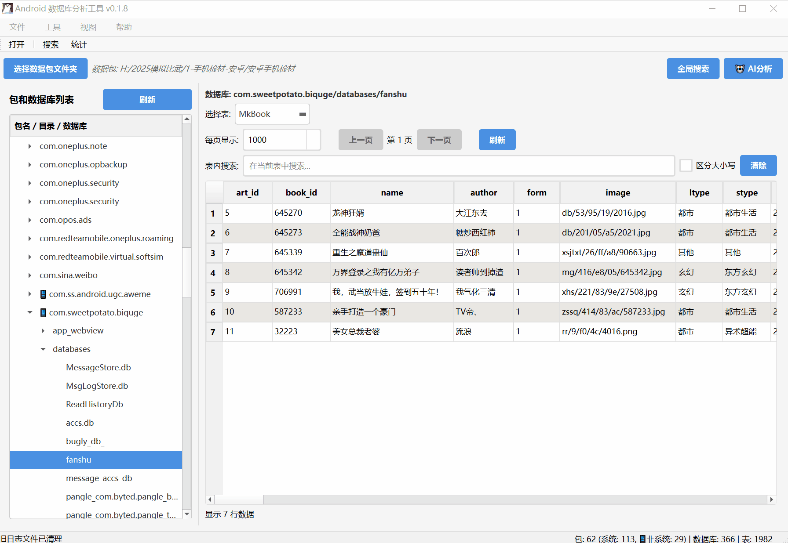

# Android Database Viewer Beta

> 🏆 **专为取证比赛设计的Android-Data数据库分析工具**  
> 快速解析手机镜像数据库文件，精准提取证据

## 📖 项目简介

Android Database Viewer Beta 是一款专门为数字取证人员开发的Android手机镜像数据库分析工具，该工具能够快速解析Android系统中`/data/data/{包名}/`下的数据库文件。

## ✨ 核心特性

### 🔍 智能数据库解析
- **自动识别包结构**：支持小米、华为等主流厂商的Android镜像结构
- **批量数据库加载**：一键加载所有应用的SQLite数据库文件
- **三级树状显示**：包名 → 目录 → 数据库的清晰层级结构
- **系统应用识别**：自动区分系统应用和用户应用，橙色图标标识

### 🔎 强大搜索功能
- **全局搜索引擎**：跨所有数据库进行关键词搜索
- **正则表达式支持**：高级模式匹配，精确定位目标数据
- **搜索结果导出**：自动保存为CSV和JSON格式，便于报告编写
- **实时搜索索引**：预构建索引，快速搜索响应
- **一键搜索可疑信息**：按照预设一键搜素可疑信息，方便直观查看。

### 🤖 AI智能分析
- **一键取证分析**：AI自动分析应用数据，提取关键证据信息
- **具体内容提取**：识别聊天记录、交易记录、联系人、密码等敏感数据
- **智能分类标注**：自动判断应用类型和取证价值等级
- **对话式查询**：支持自然语言提问，深度挖掘证据线索

### 📊 可视化界面
- **数据表格展示**：清晰显示数据库表结构和内容
- **拖拽式操作**：支持拖拽加载镜像文件
- **右键菜单**：快捷访问常用功能
- **多线程后台**：流畅的用户体验，不卡顿

## 🚀 快速开始

### 环境要求
```bash
Python 3.8+
PySide6
requests
sqlite3
```

### 安装步骤
```bash
# 克隆项目
git clone https://github.com/your-username/AndroidDatabaseViewerBeta.git
cd AndroidDatabaseViewerBeta

# 安装依赖
pip install -r requirements.txt

# 运行程序
python main.py
```

**（或直接下载已编译好的exe文件）**


### 基本使用

1. **加载镜像**：拖拽Android文件夹到程序窗口，自动加载
2. **浏览数据**：在左侧树状结构中选择应用和数据库进行查看
3. **搜索证据**：使用全局搜索功能查找关键信息
4. **AI分析**：点击"🤖 AI分析"进行智能取证分析
5. **导出结果**：保存搜索结果和分析报告

## 🏗️ 技术架构

```
AndroidDatabaseViewerBeta/
├── src/
│   ├── core/               # 核心功能模块
│   │   ├── database_manager.py    # 数据库管理
│   │   ├── file_parser.py         # 文件解析
│   │   ├── ai_analyzer.py         # AI分析引擎
│   │   └── log_manager.py         # 日志管理
│   ├── gui/                # 用户界面
│   │   ├── main_window.py         # 主窗口
│   │   ├── package_tree.py        # 包树视图
│   │   ├── database_viewer.py     # 数据库查看器
│   │   ├── search_dialog.py       # 搜索对话框
│   │   └── ai_analysis_dialog.py  # AI分析界面
│   └── assets/             # 资源文件
├── config/                 # 配置文件
├── log/                   # 日志目录
└── main.py               # 程序入口
```

## 🔧 配置说明

### AI配置
支持本地和远程AI模型：
- **本地模型**：LM Studio + Qwen2.5等开源模型
- **远程API**：OpenAI、Claude等商用API
- **推荐配置**：Qwen2.5-3B-Instruct (32K上下文)

### 搜索配置
- 索引构建：自动/手动模式
- 搜索范围：全库/指定应用
- 结果限制：可配置最大结果数

## 📊 性能指标

- **加载速度**：1000个数据库 < 30秒
- **搜索响应**：毫秒级全文检索
- **内存占用**：< 500MB（中等规模镜像）
- **支持规模**：10GB+ Android镜像文件

## 📟实际演示

### 加载镜像



### 查看数据库

可使用滚轮快速切换表



### 搜索文本

（如果结果过多会卡死，后续版本会修复）



### AI解析（Beta）

演示由于耗时较长，中间省略了加载的部分

>1.由于可能数据库内容较大，该功能对每一个包下的数据库先输入整个结构，再传入每个表的第一行，总计不超过2w tokens，因此解析出来的内容不完整
>
>2.解析的结果可能与实际不同，请以手工分析为准


---

> 💡 **提示**：如果这个工具对您的取证工作有帮助，请给个⭐Star支持一下！

> 🏆 **比赛加油**：祝愿所有使用本工具的选手在数字取证竞赛中取得优异成绩！ 